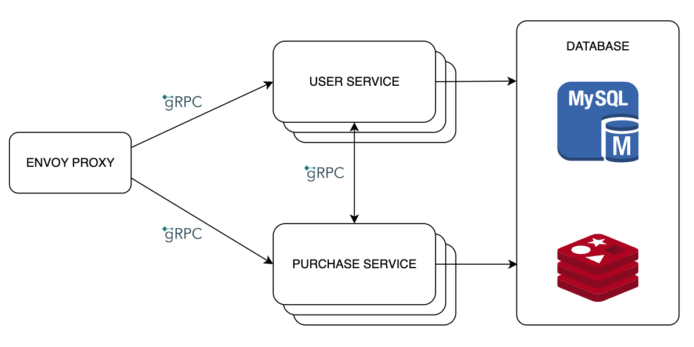

# Problem Assumption

Assume that we have a system that manages users and provides subscription plans that users can purchase.
This source code helps the system create campaigns and gives a voucher to the first 100 users who register using the campaign's link. This voucher provides a 30% discount when the user subscribes to the SILVER plan.

---
# System Architecture

---
# Tech stack
- Constraints:
  - Scope of Requirement: Focused on implementing the campaign creation and voucher allocation feature.
  - Timeline: Implementation should be completed within 3 days.
  - Scalability & Availability: The solution must run seamlessly on multiple pods, ensuring high availability and scalability.
  - Generality: The design should support future campaigns with minimal changes.
- Details:
  - Microservices with Golang for highly performant services
  - Data management: MySQL for main database and Redis for data caching.
