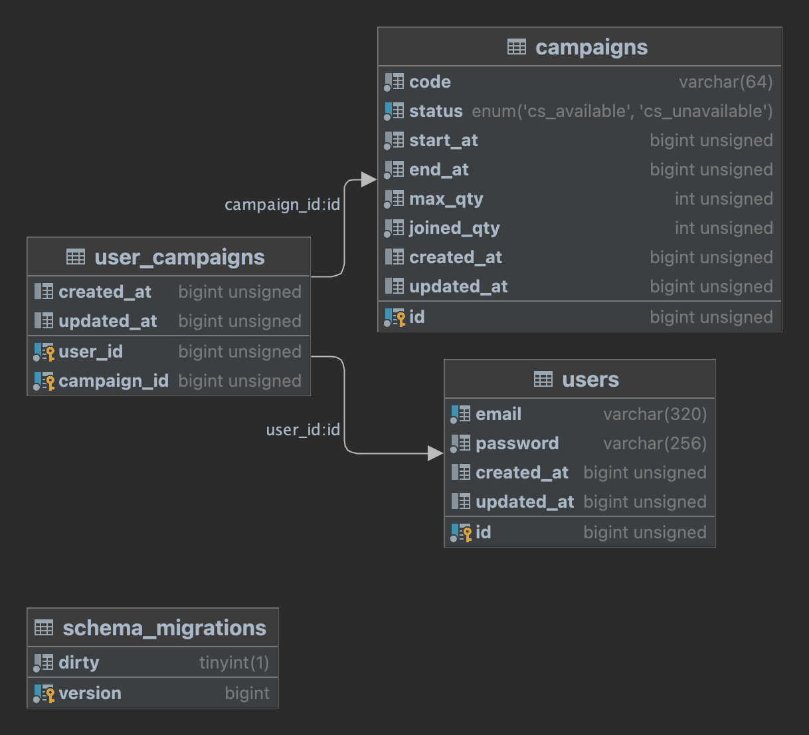
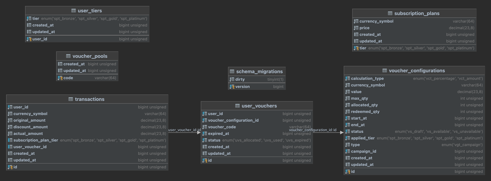

# User database
Tables:
- `users`: manage users.
- `campaigns`: manage campaigns.
- `user_campaigns`: manage users that registered with a campaign.

# Purchase database
Tables:
- `voucher_pools`: manage reserved codes.
- `voucher_configurations`: manage voucher codes for a campaign.
- `user_vouchers`: manage user's vouchers.
- `subscription_plans`: manage subscription plan info (prices, discount amount,...).
- `user_tiers`: manage tier of user after buy subscription plan.
- `transactions`: manage buying history of users.

